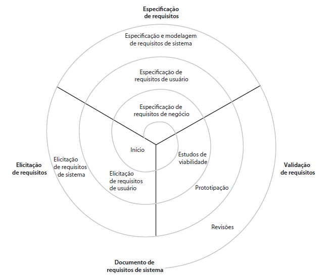
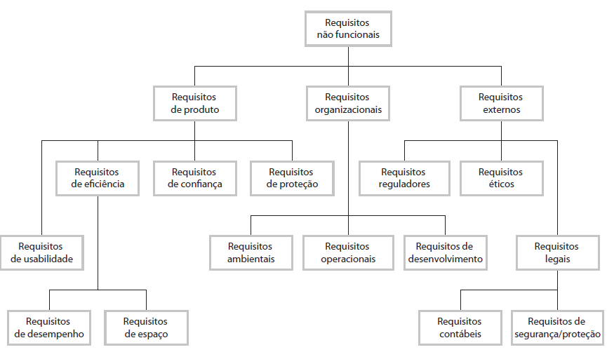

## Processo

1. Estudo de viabilidade para o negócio.
2. Elicitação e análise dos requisitos do sistema.
3. Especificação dos requisitos, documentação dos requisitos.
4. Validação dos requisitos com o objetivo do sistema para o cliente.

### Fluxo do processo de construção da especificação de requisitos

### Classificação dos requisitos

#### Quanto ao nível de detalhamento

1. **Requisitos de Usuários**: definem os serviços que o sistema deverá fornecer e as restrições com as quais o sistema deverá operar. Podem ser escritos utilizando linguagem natural, diagramas ou outras notações compreensíveis aos clientes.
2. **Requisitos de Sistema**: possui um maior detalhamento sobre as funções, serviços e restrições do sistema. Define exatamente o que deve ser implementado.

#### Requisitos funcionais e não funcionais

1. Funcionais: especificam o que os serviços/funcões que o sistema deve oferecer ao usuário, assim como suas limitações/restrições.
2. Não funcionais: especificam restrições técnicas ao funcionamento do sistema.

##### Requisitos funcionais e não funcionais

## Documentação de Requisitos

É a declaração do que os desenvolvedores devem implemetar. O documento deve focar no "o que" e não no "como". A seguir um exemplo de estrutra para uma Documentação de Requisitos, podendo esta ser alterada livremente de acordo com a necessidade do projeto.

- **Prefácio**: Deve definir os possíveis leitores do documento e descrever seu histórico de versões, incluindo uma justificativa para a criação de uma nova versão e um resumo das mudanças feitas em cada versão.
- **Introdução**: Deve descrever a necessidade para o sistema. Deve descrever brevemente as funções do sistema e explicar como ele vai funcionar com outros sistemas. Também deve descrever como o sistema atende aos objetivos globais de negócio ou estratégicos da organização que encomendou o software.
- **Glossário**: Deve definir os termos técnicos usados no documento.
- **Definição de Requisitos de Usuário: Deve descrever os serviços fornecidos ao usuário. Os requisitos não funcionais de sistema também devem ser descritos nessa seção. Essa descrição pode usar linguagem natural, diagramas ou outras notações compreensiveis aos clientes. Normas de produto e processos que devem ser seguidos devem ser especificados.
- **Arquitetura do Sistema**: Deve apresentar uma visão geral em alto nível da arquitetura do sistema previsto, mostrando a distribuição de funções entre os módulos do sistema. Componentes de arquitetura que são reusados devem ser destacados.
- **Especificação de requisitos do sistema**: Deve descrever em detalhes os requisitos funcionais e não funcionais. Se necessário, também podem ser adicionados mais detalhes aos requisitos não funcionais. Interfaces com outros sistemas podem ser definidas.
- **Modelos do Sistema**: Pode incluir modelos gráficos do sistema que mostram os relacionamentos entre os componentes do sistema, o sistema e seu ambiente. Exemplos de possíveis modelos são modelos de objetos, modelos de fluxo de dados ou modelos semânticos de dados.
- **Evolução do sistema**: Deve descrever os pressupostos fundamentais em que o sistema se baseia, bem como quaisquer mudanças previstas, em decorrência da evolução de hardware, de mudanças nas necessidades do usuário, etc. Essa sseção é útil para projetistas de sistema, pois pode ajudá-los a evitar decisões capazes de restringir possíveis mudanças futuras no sistema.
- **Apêndices**: Deve fornecer informações detalhadas e especificas relacionadas à aplicação em desenvolvimento, além de descrições de hardware e banco de dados, por exemplo. Os requisitos de hardware definem as configurações mínimas ideais para o sistema. Requisitos de banco de dados definem a organização lógica dos dados usados pelo sistema e os relacionamentos entre esses dados.
- **Índice**: Vários índices podem ser incluídos no documento. Pode haver, além de um índice alfabético normal, um índice de diagramas, de funções, entre outros pertinentes.

## Elicitação e análise de requisitos

Os analistas de requisitos atuam juntamente com clientes e usuários finais so sistema para obter informações sobre o domínio da aplicação, os serviços que o sistema deve oferecer, o desempenho do sistema, restrições de hardware e assim por diante.

### Desafios:

- Clientes/usuários costumam apresentar dificuldades em articular as suas necessidades, e podem fazer exigências inviáveis/impossíveis.
- Clientes/usuários possuem uma coleção de termos próprios e conhecimentos implícitos, que pessoas fora do domínio podem não entender.
- Pessoas diferentes expressam requisitos diferentes, fazendo com que analistas de requisitos explorem todas as potenciais fontes de requisitos para descobrir semelhanças e conflitos.
- Fatores políticos podem influenciar em requisitos especificos para determinada classe de usuários do sistema, por exemplo gerentes terem acessos exclusivos.
- O ambiente econômico e empresarial no qual a análise ocorre é dinâmico, tornando inevitável que ocorram mudanças no processo de análise, seja na importância ou definição de requisitos novos ou existentes.

### Processo de Elicitação e Análise de Requisitos

- 1.1 Descoberta dos requisitos (elicitação)
- 2.1 Classificação e organização de requisitos (análise)
- 2.2 Priorização e negociação de requisitos (análise)
- 3.1 Especificação de requisitos (especificação)
- 4.1 Validação dos requisitos (validação)

### Elicitação de requisitos
Processo de reunir informações sobre o sistema requerido e os sistemas existentes e separar dessas informações os requisitors funcionais e não funcionais para o sistema, realizada em um primeiro momento em alto nível.
- **Fontes de Informação**: documentação, clientes/usuários do sistema ou especificações de sistemas similares.
- **Técnicas**: observação/etnografia (imersão), entrevistas, cenários, protótipos.

Para o processo de levantamento dos requisitos é interessante considerar consultar diferentes tipos de clientes/usuários e as partes interessadas em geral para obter o máximo de informações possíveis. Um requisito funcional do sistema requer a elaboração de um caso de uso, onde em um primeiro momento o seu fluxo é simplificado de modo a não incluir limitações ou restrições ao seu funcionamento, e posteriormente sendo realizado o detalhamento deste requisito, que com a implementação de regras de negócios, interações, permissões, etc. pode depender de estados ou variáveis envolvidas na sua execução, por exemplo, criando então diferentes fluxos para a execução de tal funcionalidade. Os fluxos de caso de uso são definidos como:

- **Principal** fluxo considerado esperado para a funcionalidade mapeada, ou seja, a execução perfeita contendo entradas e saídas esperadas para o requisito.
- **Alternativo** fluxos que podem estar mapeando ações adversas que o usuário pode estar executando, que foge do fluxo principal, como ausência de preenchimento de campos obrigatórios ou escolhas que desviam a execução do fluxo principal podendo alterar o comportamento da aplicação e até mesmo o resultado da resposta.
- **Exceção** compreende erros ou bugs que podem acontecer durante a execução de uma funcionalidade.

## Gerenciamento de Requisitos

### Necessidade

O sistema precisa estar sempre em pleno funcionamento, sendo útil aos negócios e aos usuários, sempre mantendo um nível de qualidade apropriado. Mas o software sempre estará em constante evolução, tornando os requisitos vulneraveis a alterações adaptativas aos novos cenários/regras que o negócio necessita.
Ao definir requisitos, é necessário visar a compreensão de todos os envolvidos, por isso se torna indispensável o conhecimento do nível da equipe técnica.

O gerenciamento de requisitos possui 3 etapas a serem executadas:
- As funções do requisitos devem estar planejadas para serem incorporadas ao software.
- A fase de desenvolvimento deve ser monitorada a fim de garantir a fiel implementação do requisito.
- Integrado ao sistema, o requisito deve contemplar as exigências dos requisitos não funcionais, validando toda a efetividade de uso em operação.

### Controle de Mudanças

A rastreabilidade dos requisitos ajudam a prever a viabilidade e o impacto de novas alterações em funções que o sistema já possui e que podem apresentar um histórico de diferentes alterações, em regras de negócios ou em relação a performace/qualidade/segurança do software. Tornando o processo previsível o mais cedo possível.

Quando o controle de mudanças de um software já possui uma base sólida na organização, é comum a adoção de técnicas oriundas da cultura DevOps (Desenvolvimento e Operações) como o CI/CD (Continuous Integration/Continuous Delivery) onde as entregas acontecem de maneira automatizada, seguindo sempre um mesmo padrão de processo que diminui o esforço e o tempo para a integração ao sistema.

#### Preparando-se para uma Alteração

A alteração de um requisito se dá tanto pela constatação de uma nova necessidade quanto pela descoberta de falta de eficiência em um requisito já registrado.

Ao receber a solicitação de um novo requisito, ou alteração de um existente, o próximo passo é proceder com a definição do mesmo de forma completa e mais importante é obter a comprovação do entendimento por parte de quem solicitou o novo requisito.

Pessman e Maxim(2021, p.321) sobre fatores relevantes para o desenolvimento de software, citam:
- "gestão de qualidade efetiva estabelece a infraestrutura que dá suporte a qualquer tentativa de construir um produto de software de alta qualidade".
- "ele satisfaz a um conjunto de requisitos implícitos que se espera de todo software de alta qualidade".
- "permite que os engenheiros de software despendam mais tempo criando aplicações novas e menos tempo em manutenções".

Adotando boas práticas no gerenciamento de requisitos temos que a definição detalhada de um requisito deve ser pouco propensa a alterações e que existam links de rastreabilidade que caracterizem as dependências entre os requisitos.

#### RTM - Requirement Traceability Matrix

Uma Matriz de Rastreabilidade de Requisitos pode ser vista como uma tabela onde as funcionalidades de um sistema são representadas de forma relacional. A matriz permite a elaboração de uma análise de impacto mais eficiente na progressão do sistema, na análise de impactos, para minimizar os riscos do projeto, aumentar a produtividade, identificar possíveis impedimentos e bloqueios e minimizar pontos de contingência.

A elaboração da Matriz de Rastreabilidade de Requisitos compreende alguns pontos importantes que serão elencados a seguir.

- **Investigação inicial**: este é o momento de diferenciar as principais necessidades e pormenores do projeto; tal análise é crucial para que os envolvidos saibam quais são as perspectivas com relação ao projeto e que possam assegurar que este seja homologado pelas partes interessadas.
- **Documentação de requisitos**: etapa para fundamentar os requisitos. Tudo que é relativo aos requisitos deve ser bem documentado e definido, podendo fazer uso de ferramentas e meios já utilizados na empresa para facilitar o processo.
Especificação dos requisitos: este é o momento de fazer a junção das informações adquiridas nos pontos anteriores para agregar informação a esta etapa que essencialmente classifica os requisitos adequadamente. Estes podem ser funcionais ou não funcionais, por exemplo.
- **Composição da Matriz de Rastreabilidade de Requisitos**: união das informações em uma matriz, especificando os requisitos que pertencerão a ela, seus respectivos detalhes e categorizações por ordem de precedência e prioridade. É importante também elencar os requisitos de acordo com o seu estado de implementação, ou seja, "em refinamento", "em desenvolvimento", "ativo" ou "cancelado".

A utilização de uma Matriz de Rastreabilidade de Requisitos proporciona para a organização do projeto:

- Gerenciar e avaliar o impacto das alterações no projeto.
- Avaliar o impacto na falha de testes das funcionalidades relacionadas aos requisitos.
- Avaliar o status em que se encontram os requisitos e determinar posteriores ações que devem ser realizadas.
- Fornecer a visibilidade de ponta a ponta para as atividades.
- Validar se os requisitos do projeto foram atendidos.

Se o patrocinador do projeto consultar o custo de um requisito modificado, ele pode obter os recursos usados na modificação de um determinado requisito em consequência das atividades realizadas. Além disso, ele pode ter a posse do montante dos esforços, compreendendo todos os artefatos modificados rastreados pela RTM.

Pelo ponto de vista da tecnologia, é possível relacionar todos os demais recursos envolvidos na modificação realizada, tais como: módulos de integração (API) com terceiros, sistemas de banco de dados envolvidos, linguagem de programação, dados para a realização dos testes automatizados, entre outros